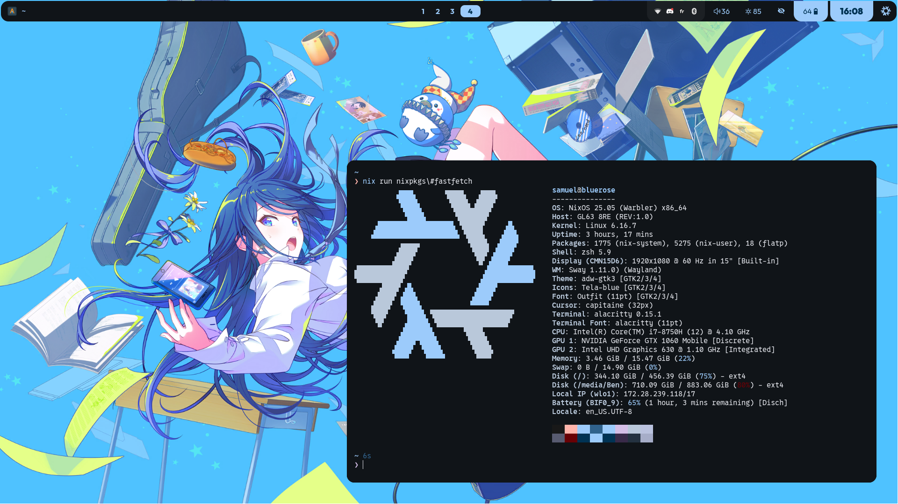

# Samuel's System Config

hi  
this is the config for my NixOS system

i update my system using scripts i shamelessly ripped from [someone](https://jade.fyi/blog/pinning-nixos-with-npins/).

as for userpace programs i use [(non-)flakey profile](https://github.com/lf-/flakey-profile/tree/0b83c10f85f92bee943e7d0a5fcd92bed2f5a215/templates/no-flake)
(which is also made by the same person who made the scripts
i use)

## wow such looks

